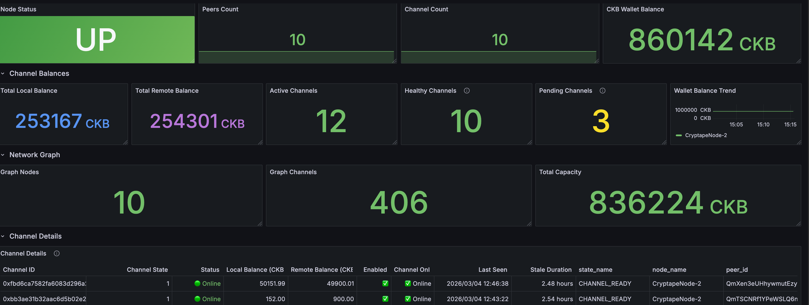

# Fiber Node Monitor

A complete Prometheus + Grafana monitoring solution for [Fiber](https://github.com/nervosnetwork/fiber) node operators.

## Features

- **Prometheus exporter** written in Python — exposes Fiber node metrics via HTTP
- **Grafana dashboard** — importable JSON with cascading template variables (`datasource → network → node`)
- **Prometheus alert rules** — covers node down, low balance, no peers, stale/disabled/offline channels
- **Multi-node / multi-network** support — one exporter per node; `network` label injected by Prometheus scrape config
- **Persistent channel state** — tracks `last_seen` timestamp per channel across restarts; only updates when the channel is fully online (CHANNEL_READY + enabled + peer connected)
- **CKB wallet balance** — decodes bech32/bech32m addresses; queries CKB Indexer

## Dashboard Preview



### Dashboard Panels

| Section | Panel | Type | Description |
|---------|-------|------|-------------|
| Node Overview | Node Status | Stat | Up/down status per node |
| Node Overview | Total Channels | Stat | Sum of all channel counts across selected nodes |
| Node Overview | CKB Wallet Balance | Bar gauge | Wallet balance per node (horizontal, gradient, red/yellow/green thresholds) |
| Node Overview | Peers Count | Timeseries | Peer count trend per node with last value in legend |
| Node Overview | Channel Count | Timeseries | Channel count trend per node with last value in legend |
| Channel Balances | Total Local Balance | Timeseries | Local balance trend per node (CKB) |
| Channel Balances | Total Remote Balance | Timeseries | Remote balance trend per node (CKB) |
| Channel Balances | Active Channels | Timeseries | CHANNEL_READY count trend per node |
| Channel Balances | Healthy Channels | Timeseries | Truly usable channels trend (READY + enabled + peer online) |
| Channel Balances | Pending Channels | Stat | Channels not yet CHANNEL_READY |
| Channel Balances | Pending Channels Over Time | Timeseries | Trend of channels not yet CHANNEL_READY over time |
| Network Graph | Graph Nodes | Timeseries | Total nodes in the network graph |
| Network Graph | Graph Channels | Timeseries | Total channels in the network graph |
| Network Graph | Total Capacity | Timeseries | Total network capacity trend (CKB) |
| Channel Details | Channel Details | Table | Per-channel breakdown with state, status, balances, and last-seen |

## Architecture

```
                        ┌─────────────────────────────────────┐
                        │         Prometheus Server            │
                        │                                      │
                        │  scrape_configs:                     │
                        │   - job: fiber-mainnet               │
                        │     labels: {network: mainnet}       │◄──┐
                        │     targets: [node1:8222, node2:8222]│   │
                        │                                      │   │ scrape
                        │   - job: fiber-testnet               │   │ /metrics
                        │     labels: {network: testnet}       │   │
                        │     targets: [node3:8222]            │   │
                        └──────────────┬──────────────────────┘   │
                                       │                           │
                               PromQL  │                 ┌─────────┴────────┐
                                       ▼                 │  Fiber Exporter  │
                        ┌──────────────────────┐         │  (per node)      │
                        │   Grafana Dashboard  │         │                  │
                        │                      │         │ fiber_exporter.py│
                        │  Variables:          │         │  :8222/metrics   │
                        │   $datasource        │         └────────┬─────────┘
                        │   $network           │                  │ JSON-RPC
                        │   $node              │         ┌────────▼─────────┐
                        └──────────────────────┘         │   Fiber Node     │
                                                         │   :8227          │
                                                         └──────────────────┘
```

## Prerequisites

- Python 3.9+
- A running Fiber node with RPC enabled
- Prometheus
- Grafana

## Quick Start (Single Node)

### 1. Clone the repository

```bash
git clone https://github.com/jiangxianliang007/fiber-node-monitor.git
cd fiber-node-monitor
```

### 2. Install dependencies

```bash
pip install -r exporter/requirements.txt
```

### 3. Configure environment

```bash
cp .env.example .env
# Edit .env with your values
```

### 4. Run the exporter

```bash
cd exporter
export $(cat ../.env | xargs)
python fiber_exporter.py
```

Metrics are available at `http://localhost:8222/metrics`.

### 5. Run with Docker

#### Using the pre-built image

```bash
# Pull the latest pre-built image
docker pull ghcr.io/jiangxianliang007/fiber-node-monitor:latest

# Run
docker run -d \
  --env-file .env \
  -p 8222:8222 \
  --name fiber-exporter \
  ghcr.io/jiangxianliang007/fiber-node-monitor:latest
```

#### Building locally

```bash
docker build -t fiber-exporter ./exporter
docker run -d \
  --env-file .env \
  -p 8222:8222 \
  --name fiber-exporter \
  fiber-exporter
```

## Multi-Node Deployment

### Running Multiple Exporters

Run one exporter instance per Fiber node. Use different ports and `NODE_NAME` values:

**Mainnet node 1** (`/etc/fiber/mainnet-01.env`):
```
FIBER_RPC_URL=http://127.0.0.1:8227
CKB_RPC_URL=https://mainnet.ckbapp.dev
CKB_ADDRESS=ckb1qz<your-mainnet-ckb-address>
EXPORTER_PORT=8222
NODE_NAME=fiber-mainnet-01
GRAPH_SCRAPE_INTERVAL=300
STATE_FILE=/var/lib/fiber/mainnet-01-state.json
```

**Testnet node 1** (`/etc/fiber/testnet-01.env`):
```
FIBER_RPC_URL=http://127.0.0.1:8228
CKB_RPC_URL=https://testnet.ckbapp.dev
CKB_ADDRESS=ckt1qzda0cr08m85hc8jlnfp3zer7xulejywt49kt2rr0vthywaa50xws...
EXPORTER_PORT=8223
NODE_NAME=fiber-testnet-01
GRAPH_SCRAPE_INTERVAL=300
STATE_FILE=/var/lib/fiber/testnet-01-state.json
```

Using Docker Compose:

```yaml
version: "3.8"
services:
  fiber-exporter-mainnet-01:
    image: ghcr.io/jiangxianliang007/fiber-node-monitor:latest
    env_file: /etc/fiber/mainnet-01.env
    ports:
      - "8222:8222"

  fiber-exporter-testnet-01:
    image: ghcr.io/jiangxianliang007/fiber-node-monitor:latest
    env_file: /etc/fiber/testnet-01.env
    ports:
      - "8223:8223"
```

### Prometheus `scrape_configs`

The `network` label is injected here — **not** in the exporter:

```yaml
scrape_configs:
  - job_name: fiber-mainnet
    static_configs:
      - targets:
          - "node1.example.com:8222"
          - "node2.example.com:8222"
        labels:
          network: mainnet

  - job_name: fiber-testnet
    static_configs:
      - targets:
          - "testnet-node1.example.com:8223"
        labels:
          network: testnet

rule_files:
  - /etc/prometheus/rules/fiber-alerts.yml
```

Copy the alert rules file:

```bash
cp prometheus/alerts.yml /etc/prometheus/rules/fiber-alerts.yml
```

### Grafana Variable Filtering

The dashboard uses three cascading template variables:

| Variable | Type | Query | Behavior |
|----------|------|-------|----------|
| `$datasource` | datasource | prometheus | Select Prometheus datasource |
| `$network` | query | `label_values(fiber_node_up, network)` | Filter by network (mainnet/testnet) |
| `$node` | query | `label_values(fiber_node_up{network=~"$network"}, node_name)` | Filter by node, scoped to selected network |

All panel queries use `{network=~"$network", node_name=~"$node"}` for consistent filtering.

## Configuration Reference

| Variable | Default | Description |
|----------|---------|-------------|
| `FIBER_RPC_URL` | `http://127.0.0.1:8227` | Fiber node JSON-RPC endpoint |
| `FIBER_RPC_TOKEN` | *(empty)* | Bearer token for Fiber RPC authentication. Set this if your node has RPC authentication enabled. |
| `CKB_RPC_URL` | `https://mainnet.ckbapp.dev` | CKB RPC / Indexer endpoint |
| `CKB_ADDRESS` | *(required)* | CKB wallet address to monitor |
| `EXPORTER_PORT` | `8222` | HTTP port for `/metrics` |
| `NODE_NAME` | `fiber-node-01` | Node identifier, added as `node_name` label |
| `GRAPH_SCRAPE_INTERVAL` | `300` | Seconds between network graph refreshes |
| `STATE_FILE` | `state.json` | Path to persist channel `last_seen` state |

> **Note:** There is no `NETWORK` variable. The `network` label is injected exclusively by Prometheus `scrape_configs`.

## Metrics Reference

### Node-level

| Metric | Type | Labels | Description |
|--------|------|--------|-------------|
| `fiber_node_up` | Gauge | `node_name` | 1 if Fiber RPC reachable, 0 otherwise |
| `fiber_node_peers_count` | Gauge | `node_name` | Number of connected peers |
| `fiber_node_channel_count` | Gauge | `node_name` | Total channel count |

### Wallet

| Metric | Type | Labels | Description |
|--------|------|--------|-------------|
| `fiber_wallet_ckb_balance` | Gauge | `node_name`, `address` | Wallet balance in CKB |

### Per-Channel

| Metric | Type | Labels | Description |
|--------|------|--------|-------------|
| `fiber_channel_local_balance_ckb` | Gauge | `node_name`, `channel_id`, `peer_id` | Local balance in CKB |
| `fiber_channel_remote_balance_ckb` | Gauge | `node_name`, `channel_id`, `peer_id` | Remote balance in CKB |
| `fiber_channel_enabled` | Gauge | `node_name`, `channel_id`, `peer_id` | 1 if enabled |
| `fiber_channel_online` | Gauge | `node_name`, `channel_id`, `peer_id` | 1 if channel is truly usable (CHANNEL_READY + enabled + peer online), 0 otherwise |
| `fiber_channel_state` | Gauge | `node_name`, `channel_id`, `peer_id`, `state_name` | Channel state (1=current state) |
| `fiber_channel_status` | Gauge | `node_name`, `channel_id`, `peer_id` | Overall channel health: 2=Online (READY+enabled+peer online), 1=Pending (not READY), 0=Offline (READY but peer offline or disabled) |
| `fiber_channel_last_seen_timestamp` | Gauge | `node_name`, `channel_id`, `peer_id` | Unix timestamp when channel was last fully online (CHANNEL_READY + enabled + peer connected); 0 if never |

### Aggregated

| Metric | Type | Labels | Description |
|--------|------|--------|-------------|
| `fiber_channels_local_balance_total_ckb` | Gauge | `node_name` | Sum of local balances |
| `fiber_channels_remote_balance_total_ckb` | Gauge | `node_name` | Sum of remote balances |
| `fiber_channels_active_total` | Gauge | `node_name` | Count of `CHANNEL_READY` channels |
| `fiber_channels_healthy_total` | Gauge | `node_name` | Count of truly usable channels (CHANNEL_READY + enabled + peer online) |
| `fiber_channels_pending_total` | Gauge | `node_name` | Count of channels not yet CHANNEL_READY |

### Network Graph (cached)

| Metric | Type | Labels | Description |
|--------|------|--------|-------------|
| `fiber_graph_nodes_total` | Gauge | `node_name` | Total nodes in the network graph |
| `fiber_graph_channels_total` | Gauge | `node_name` | Total channels in the network graph |
| `fiber_graph_total_capacity_ckb` | Gauge | `node_name` | Total network capacity in CKB |

## Alert Rules Reference

| Alert | Condition | Duration | Severity |
|-------|-----------|----------|----------|
| `FiberNodeDown` | `fiber_node_up == 0` | 2m | critical |
| `FiberWalletBalanceLow` | `fiber_wallet_ckb_balance < 100` | 5m | warning |
| `FiberNoPeers` | `fiber_node_peers_count == 0` | 5m | warning |
| `FiberChannelStale` | `(time() - fiber_channel_last_seen_timestamp > 86400) and (fiber_channel_last_seen_timestamp > 0)` | 10m | warning |
| `FiberChannelPeerOffline` | `fiber_channel_online == 0` | 15m | warning |
| `FiberChannelDisabled` | `fiber_channel_enabled == 0` | 10m | warning |

## Grafana Dashboard Import

1. Open Grafana → **Dashboards** → **Import**
2. Upload `grafana/fiber-node-dashboard.json` or paste its contents
3. Select your Prometheus datasource
4. Click **Import**

The dashboard will auto-populate the `$network` and `$node` variables from your Prometheus labels.

## Testing Endpoints

For development and debugging:

```bash
# Test Fiber RPC
curl -X POST http://127.0.0.1:8227 \
  -H 'Content-Type: application/json' \
  -d '{"id":1,"jsonrpc":"2.0","method":"node_info","params":[]}'

# Test CKB balance query (testnet)
curl -X POST https://testnet.ckbapp.dev \
  -H 'Content-Type: application/json' \
  -d '{
    "id":1,"jsonrpc":"2.0","method":"get_cells_capacity",
    "params":[{
      "script":{
        "code_hash":"0x9bd7e06f3ecf4be0f2fcd2188b23f1b9fcc88e5d4b65a8637b17723bbda3cce8",
        "hash_type":"type",
        "args":"0x<your-lock-args>"
      },
      "script_type":"lock"
    }]
  }'
```

## License

[MIT](LICENSE)
